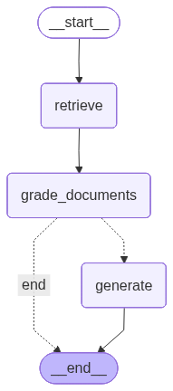
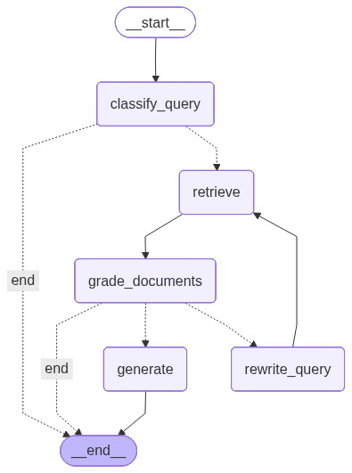

# Clinical Guideline RAG LangGraph

> ✅ **Status:** V1 complete. Linear RAG pipeline fully operational.

Clinical guidelines are long, dense, and hard to query quickly when you need a specific answer. This project addresses this by letting you ask natural language questions against a clinical guideline and get referenced, evidence-backed responses in seconds.

This is a proof of concept built on the ATS/IDSA 2019 Community-Acquired Pneumonia (CAP) guidelines, demonstrating how LangGraph-based retrieval patterns can be applied to structured clinical documents. It is an educational portfolio project - not a validated clinical tool.

## About This Project

I'm building a career in AI/ML engineering, with a focus on applied AI in healthcare. My background is clinical, which is why this problem space feels worth working on — the gap between available information and fast, reliable access to it has real consequences. I have grounding in machine learning, agentic systems, and RAG through focused coursework, and I'm deepening that through projects like this one.

I used AI assistance throughout this project — as a thinking partner for architecture decisions, tradeoff analysis, and documentation feedback. Every design decision in this project was reasoned through deliberately; the goal was to build understanding, not just output.

**What it does:**

- Accepts clinical queries about CAP diagnosis and treatment
- Retrieves relevant chunks from the ATS/IDSA 2019 guidelines
- Grades retrieved documents for relevance
- Generates a referenced answer with source citations
- Returns evidence strength ratings (Strong/Conditional) where applicable

**What it does not do:**

- Diagnose patients
- Recommend treatment
- Replace clinical judgment
- Guarantee accuracy of clinical content

## Architecture

LangGraph facilitates building, debugging, and extending complex agentic pipelines via structured state management, standardized node interfaces, and observable execution paths.

This project is built as a stateful LangGraph graph where each step in the pipeline is an isolated, testable node connected by explicit edges. All data flows through a shared state object passed automatically between nodes.

### V1 Graph (Implemented)

A linear pipeline: retrieve, grade, generate



### V2 Graph (Implemented)

A self-correcting agentic loop. Out-of-scope queries are caught at classification before retrieval is attempted. If retrieved documents fail grading, the query is rewritten and retrieval is retried up to 3 times.



To generate: `uv run python generate_graph.py` 

### Graph Visualization

(Graph visualization coming soon — auto-generated by LangGraph.)_

### Project Structure

```
guideline-rag-langgraph/
├── config.py          # all settings: chunk size, model names, paths
├── ingest.py          # PDF → chunks → embeddings → ChromaDB
├── query.py           # entrypoint: query → graph → answer + citations
├── graph/
│   ├── state.py       # GraphState TypedDict — shared state between nodes
│   ├── nodes.py       # retrieve, grade_documents, generate
│   ├── edges.py       # conditional routing logic (stubbed for V2)
│   └── graph.py       # assembles and compiles the LangGraph graph
└── data/
    └── README.md      # instructions for obtaining the source PDF
```

## Evaluation

V1 includes a 12-question evaluation set covering queries across outpatient, nonsevere inpatient, and severe inpatient CAP settings. Each question includes a ground truth answer, evidence strength rating, source location within the guideline, and an annotation of what clinical reasoning capability it tests. The eval set is in `data/test_questions.md`.

## Tech Stack

| Component             | Technology            | Why                                                                                                     |
| --------------------- | --------------------- | ------------------------------------------------------------------------------------------------------- |
| Orchestration layer   | LangChain             | Document loading, text splitting, vector store integration, and LLM wrappers                            |
| Graph framework       | LangGraph             | Stateful graph enables agentic loop, conditional edges, cycles, and shared state                        |
| Vector store          | ChromaDB              | Local, open-source, no API key required — fully reproducible for anyone cloning this repo               |
| Embeddings            | sentence-transformers | Open-source, runs locally, no API dependency or cost                                                    |
| PDF extraction        | pypdf                 | Open-source license, sufficient for structured PDF text extraction at V1 scope                          |
| Dependency management | uv                    | Fast, modern Python package manager with deterministic lockfile — reproducible installs across machines |
| LLM backend           | Ollama                | Local, private, cost-free inference — no API key required. OpenAI backend support planned for V2.       |

## How to Run

### Prerequisites

- [uv](https://docs.astral.sh/uv/) installed
- [Ollama](https://ollama.ai/) running locally
- ATS/IDSA 2019 CAP guideline PDF — see `data/README.md` for instructions

### Setup

```bash
git clone https://github.com/jvrbntz/guideline-rag-langgraph
cd guideline-rag-langgraph
uv sync
```

### Build the vector store

```bash
uv run python ingest.py
```

To use a different PDF, place it in the `data/` directory and update `PDF_FILENAME` in `config.py` to match the filename.

### Query the system

```bash
uv run python query.py
```

## Example Output

**Query:**
What is the recommended empiric antibiotic for an otherwise healthy adult
with CAP in the outpatient setting?

**Answer:**
For outpatient CAP in adults without comorbidities, the ATS/IDSA 2019
guideline recommends amoxicillin 1g three times daily or doxycycline
100mg twice daily as first-line options.

Notably, macrolide monotherapy (azithromycin, clarithromycin) is no longer strongly recommended — a departure from the 2007 guidelines — due to pneumococcal resistance rates exceeding 30% in the US. Macrolides remain an option only where local resistance is documented below 25%.

**Evidence strength:** Strong recommendation, moderate quality of evidence
(amoxicillin); Conditional recommendation, low quality of evidence (doxycycline)

**Sources:**

- cap_guideline.pdf | Question 8 | Outpatient Antibiotic Treatment
- cap_guideline.pdf | Table 3 | Initial Treatment Strategies for Outpatients

## Evaluation Results

### Summary Findings

Evaluation completed on 12 questions

| Metric                    | Result                                    |
| ------------------------- | ----------------------------------------- |
| Faithfulness              | 12/12 grade 3                             |
| Answer Relevance (grades) | grade 3: 2, grade 2: 8, grade 1: 2        |
| Answer Relevance (scores) | avg 0.62, min 0.15, max 0.83              |
| Citation Present          | 12/12                                     |

12 questions evaluated across outpatient, nonsevere inpatient, and severe inpatient CAP settings. Faithfulness scored 3/3 across all questions —
consistent with strong retrieval grounding, though local LLM judge leniency cannot be ruled out without manual cross-validation.

Question 5 is a complex clinical query requiring multi-tiered context. Answer Relevance scored 0.15, indicating low semantic alignment. The generated answer was correct but incomplete, reflecting partial context caused by fixed-size chunking splitting a multi-part recommendation across chunk boundaries.

Question 6 answer relevance (0.44) reflects two compounding factors: fixed-size chunking truncates the MRSA treatment chunk before linezolid is retrieved, and the complete dosing is attributed to the 2016 ATS/IDSA HAP/VAP guidelines via a table footnote — a cross-reference outside this document's scope.

### V2 Findings (Chunk Size 1024, Overlap 200)

Chunk size increased from 512 to 1024 and overlap from 50 to 200. Answer Relevance average improved marginally from 0.62 to 0.64. Grade distribution improved: grade 1 decreased from 2 to 1, grade 3 increased from 2 to 3.

Question 5 scored 0.10, worse than V1 (0.15). Question 5 kept 5/5 retrieved chunks after grading, larger chunks passed more context to the LLM, diluting the two-tier MRSA structure the answer requires. Question 6 improved from 0.44 to 0.56, upgrading from grade 1 to grade 2.

Section-aware chunking was investigated but deferred, PyPDF's multi-column extraction produces inconsistent text ordering, making regex-based section splitting unreliable.

## V2 Roadmap

- [x] Evaluate chunking strategies — tested CHUNK_SIZE=1024 CHUNK_OVERLAP=200; marginal overall improvement, Q6 improved, Q5 regressed due to context dilution
- [x] Self-correcting retrieval loop with query rewriting
- [ ] Implement evaluation pipeline: retrieval recall, answer faithfulness, and semantic similarity scoring

## Known Limitations

**V2 scope limitations:**

- No hallucination detection — V1 does not verify that generated answers are grounded in retrieved content. The LLM may produce responses that go beyond or contradict the source guideline.
- Faithfulness judge leniency: all 12 questions scored 3/3, suggesting the local LLM judge model may be too permissive.
- Answer relevance on complex queries: Q5 scored 0.15, the lowest in the eval set, consistent with naive chunking splitting multi-step clinical reasoning across chunk boundaries.
- Cross-referenced guidelines: Q6 requires information attributed to the 2016 ATS/IDSA HAP/VAP guidelines. Single-document scope means cross-references cannot be resolved. Grade 1 answer relevance on this question reflects a retrieval scope limitation, not a reasoning failure.

**Data and retrieval limitations:**

- Naive fixed-size chunking may split recommendation statements across chunk boundaries, degrading retrieval quality. Tables and structured dosing information lose formatting during PDF extraction.
- Single document scope — V1 indexes one guideline only. Queries requiring synthesis across multiple guidelines are out of scope.
- Query rewrite loop is implemented but rarely triggers in practice. The document grader is permissive enough to keep at least some chunks on most in-scope queries. 

**Clinical limitations:**

- Not clinically validated — outputs have not been reviewed for clinical accuracy or safety.
- Not tested with real users — system has not been evaluated with any intended user population.
- Single guideline scope — covers ATS/IDSA 2019 CAP only.

## License

MIT — free to use and adapt. Not for clinical use.
